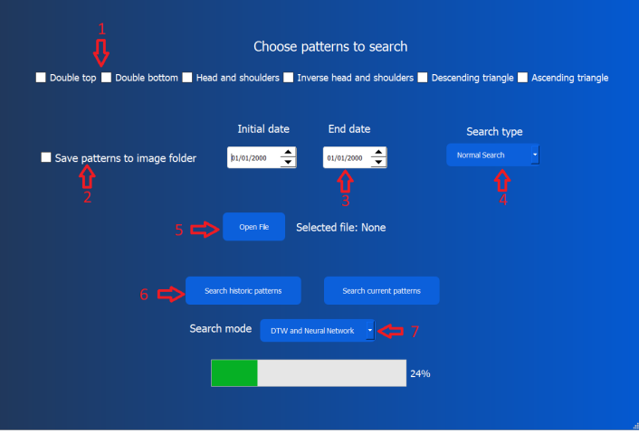

# PerseumAI

## What is PerseumAI?

PerseumAI is an AI-powered tool designed to detect technical analysis patterns in financial markets. Originally developed using the Dynamic Time Warping (DTW) algorithm, this project enhances the pattern detection process by incorporating convolutional neural networks (CNNs) using PyTorch, improving the previous algorithm and updating the interface. It focuses on identifying classical chart patterns such as:

- Double Top
- Double Bottom
- Ascending Triangle
- Descending Triangle
- Head and Shoulders
- Inverse Head and Shoulders

This tool helps traders and analysts spot these formations automatically across multiple assets, improving the precision and scalability of technical analysis.

---

## How to Use

The main interface of PerseumAI allows users to perform pattern detection using different algorithms and configurations. Below is a screenshot of the final interface:

### Main Features

1. **Select Patterns**: Choose which chart patterns to search for using checkboxes.
2. **Save Images**: Option to save detected patterns as images.
3. **Date Range**: Define the initial and final dates to analyze historical data.
4. **Company Tickers**: Upload a `.txt` file containing the stock tickers to analyze (one per line).
5. **Search Type**: Choose the depth of the search (e.g., basic, deep, very deep).
6. **Search Mode**: Choose whether to use DTW, neural networks, or both.
7. **Search Buttons**: Separate buttons to detect either historical or current patterns.

These options offer flexibility and ease of use without requiring the user to understand complex parameters like window sizes or similarity thresholds.

---

## What I Learned

Throughout the development of PerseumAI, I acquired significant knowledge in various advanced topics and technologies:

### 1. **Dynamic Time Warping (DTW) Algorithm**

DTW is a technique used to compare time series even when they differ in speed or length. I learned how to use it to measure the similarity between price windows and predefined patterns. DTW returns a distance metric — the smaller the distance, the higher the similarity. This was essential for initial pattern detection and remained a benchmark when testing neural networks.

### 2. **Neural Network Theory**

I delved into the theory behind convolutional neural networks (CNNs), particularly how they process and classify image data. I designed and trained models both for individual pattern types and a general model that distinguishes among all classes. This included:
- Building the network architecture
- Using convolutional and pooling layers
- Understanding overfitting, generalization, and test/train splits
- Optimizing performance with confidence thresholds

### 3. **PyTorch Framework**

Using PyTorch, I implemented and trained the CNN models:
- Managed tensors and model parameters
- Built data pipelines for real and synthetic pattern images
- Leveraged tools like data augmentation and loss functions
- Exported trained models for deployment within PerseumAI

This helped me develop strong practical skills in deep learning and computer vision.

### 4. **Building GUI Applications with PyQt5**

I used **PyQt5** and **PyQt5 Designer** to develop a graphical interface for the application. This made PerseumAI much more user-friendly and functional. I learned to:
- Design responsive interfaces visually
- Handle user input and integrate backend functionality
- Solve issues from the previous interface (like freezing when loading too many patterns)
- Improve usability by abstracting technical parameters into intuitive options (e.g., search types instead of window sizes)

---

## Download

Download the app [here](https://drive.google.com/drive/u/3/folders/1zamDM6P3yZu2WfTnJ_ACzeL7Q8B31xwH)  
You could also run it locally using python with `python source/PerseumAI.py`

---

## License

MIT License.

---

## Acknowledgments

- [Original repository](https://github.com/joseantpul/PerseumAI)
- Original PerseumAI by Gabriel García (2022)
- Improvements by Aitor Alonso (2023)
- Current version enhanced with neural networks, algorithm refinements, and a new UI.

---

## Final Note

This project was developed as my **Bachelor’s Thesis (Trabajo Final de Grado - TFG)**. 
You can find the thesis report [here](https://riull.ull.es/xmlui/handle/915/39946). For this work, I received the highest grade possible (10 out of 10).
